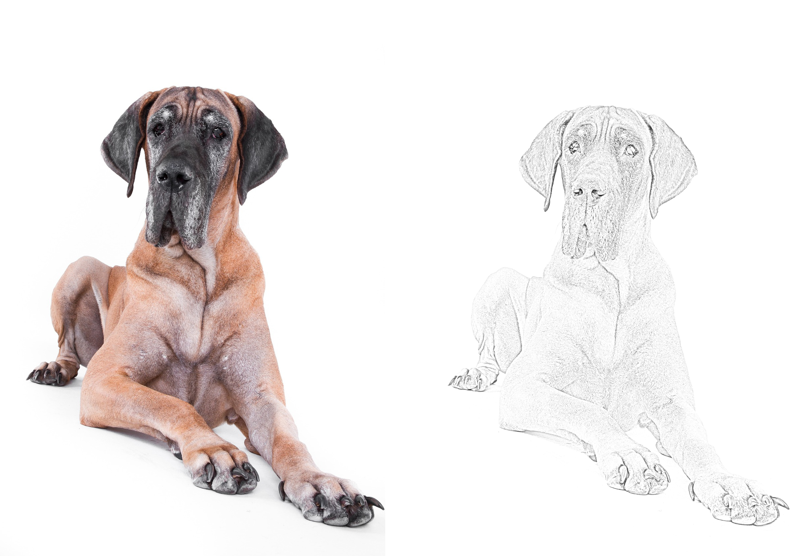

# IMGTOSKETCH
A tool that allows you to transform an ordinary image into an image that looks like a pencil sketch. Just run the script where the image you want to convert is located, type the name of the image and hit enter. The converted image will appear in the same folder.<br/>
<br/>


# Installation
You will need `opencv-python` to run IMGTOSKETCH. Install it by using:
```
pip install opencv-python
```

# Usage
1. Run IMGTOSKETCH
2. Input image name (must be in the script directory) and click enter
3. Output will be in the script directory

# Legal
Developer assume no liability and is not responsible for any misuse or damage caused by IMGTOSKETCH. Only use for educational purposes! Program was invented to show python capabilities.
